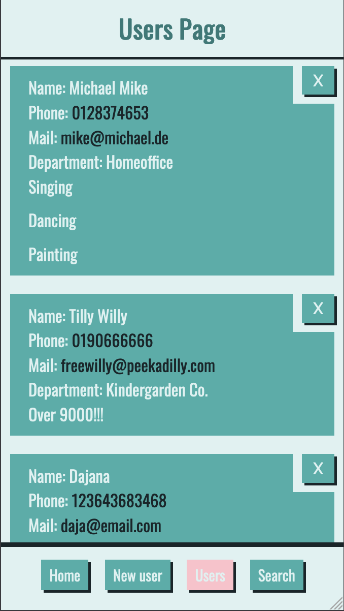
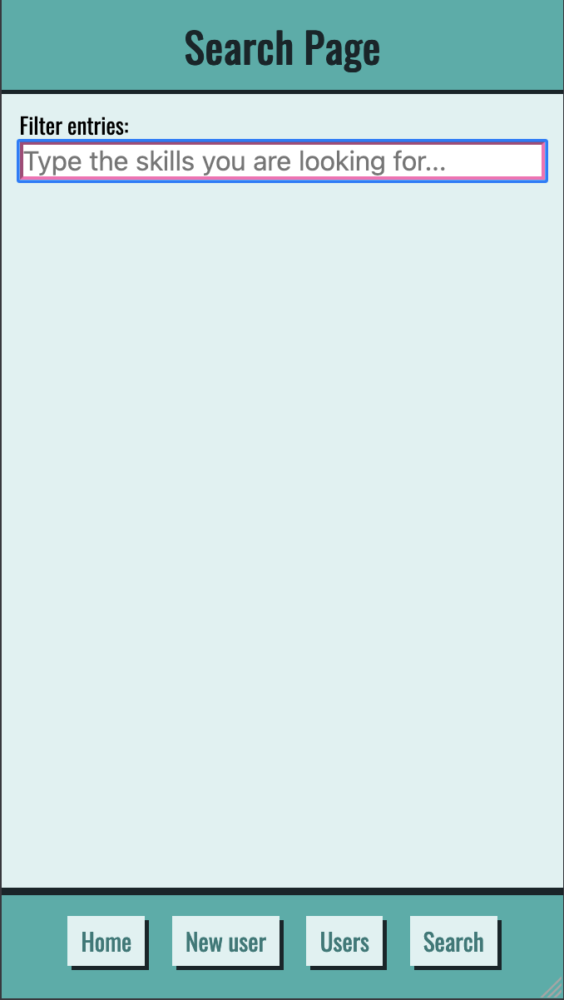

  

---

the bigger a company is, the less is known about the individual employees. a lot of skills remain hidden and problems that could be solved internally are solved by external people. this causes unnecessary costs. with the skills app i make the invisible skills visible.

This app was developed as my capstone project during the final four weeks of the neuefische Web Development Bootcamp in June/July 2021.

---

## App Impressions

  
     
     
     

---

## Tech stack

- React
- Styled-Components
- React Router
- MongoDB
- Express
- Mongoose
- Axios
- Rest Client

---

## How to set it up

- clone this repository
- install all npm dependencies  
   `npm install`
- to run the app in development mode `npm run dev`, then open [http://localhost:3000](http://localhost:3000) to view it in the browser
- to run Storybook  
  `npm run storybook`
- to run React Testing Library & Jest  
  `npm test`
